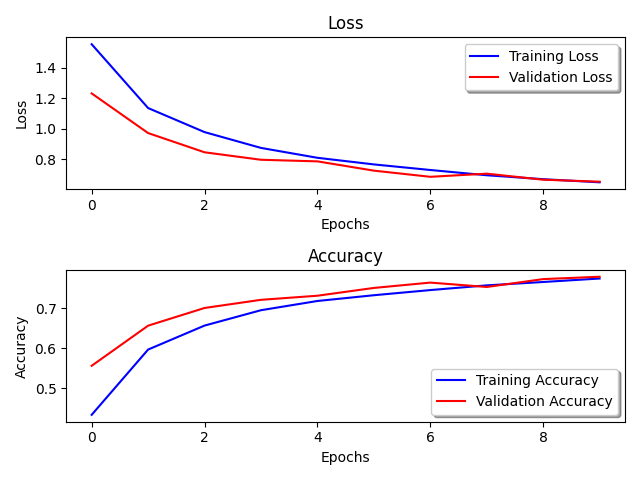
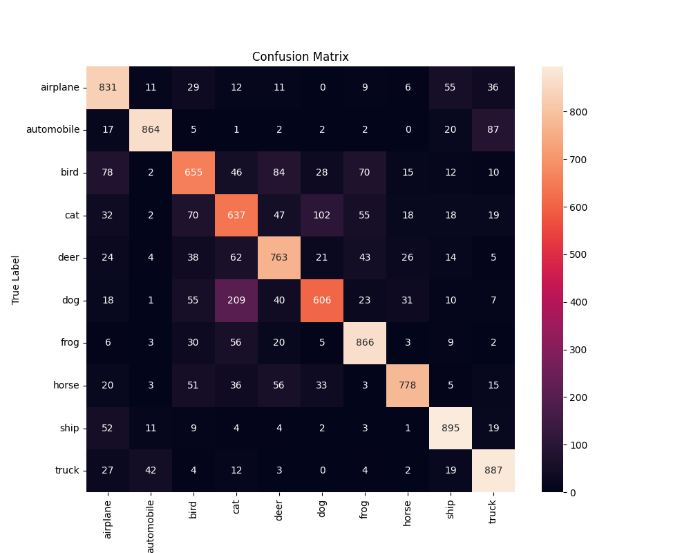
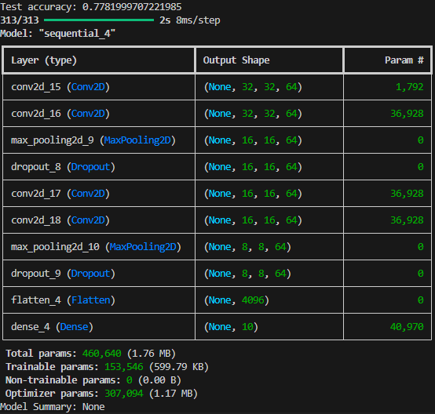
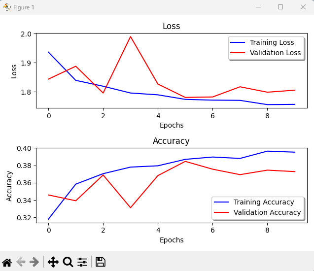
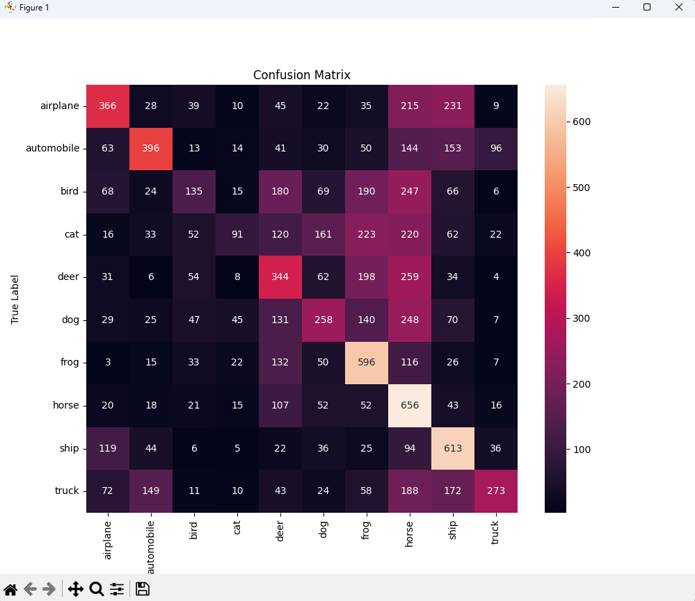

# Reflection
 - Running the model on the MNIST dataset is a lot more accurate than using the CIFAR10 dataset, which is to be expected because CIFAR10 is a lot more complex than MNIST because it used RGB instead of grayscale, and the objects to identify are more complex as well. 
 - I actually didn't make too many changes to it, but I did end up changing it so that all of the Conv2D layers had 3x3 p0x kernels, instead of how the first used to have a 5x5 p0x kernel. Doing so did make it a little bit more accurate, but not by a super duper significant amount.
 - I don't really know what else I would try to improve; like obviously I know that it can be improved, that I clearly haven't made the best possible model for the dataset. But I don't really know where to start with the improvements, partially because anything that seems to increase the accuracy by much also seems to be overfitting the model as well, which actually ends up making it worse so I wouldn't know how to make it better. 

 ## Model_lol - just for funsies
  - I added this because I was just curious how it would do, because it got around a 92% accuracy and 30% loss with the MNIST dataset. 
  - it did significantly worse with the CIFAR10 dataset, which was to be expected, at only 36% accuracy and an amazing 183% loss.
  
  